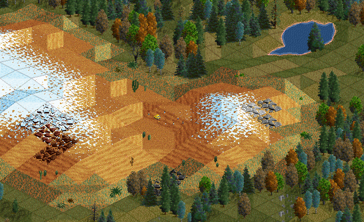
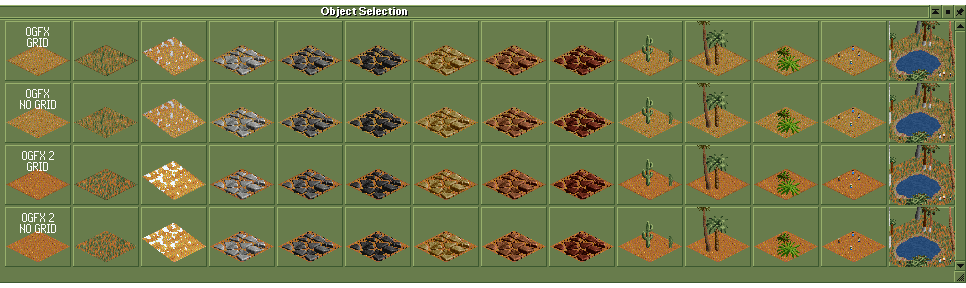
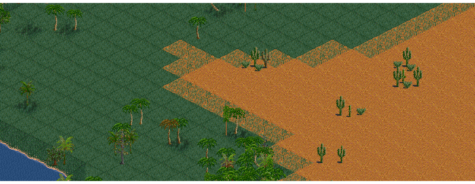
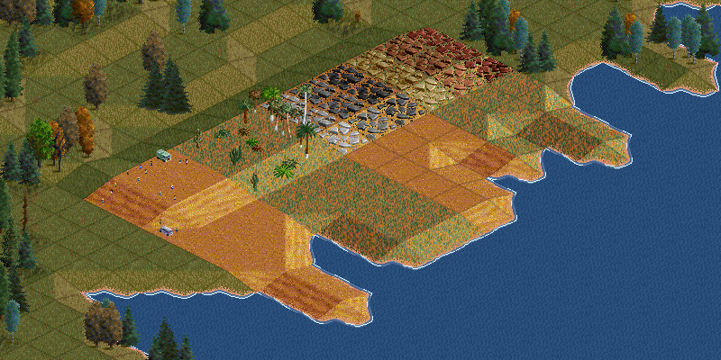
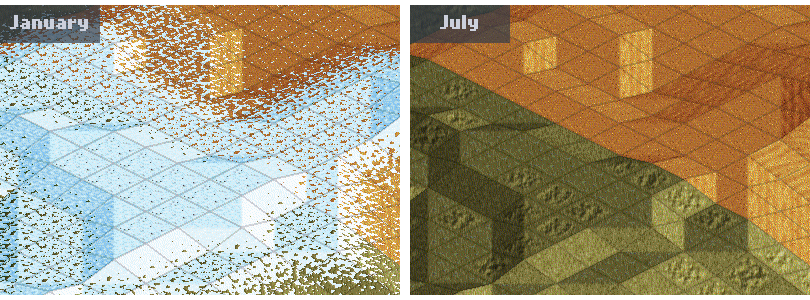
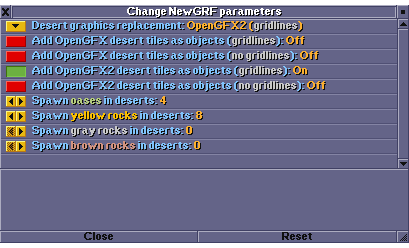
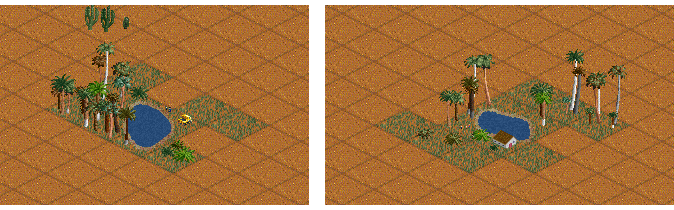
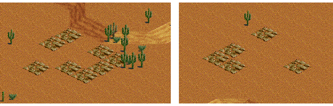

## About

The main goal of this NewGRF is to provide a **desert landscape**, regardless of your map's climate. 
It utilizes desert tiles from OpenGFX and OpenGFX2 **as objects**; both versions also come in variants _with_ and _without_ gridlines, resulting in four possible combinations of tiles. 
The ground tiles are complemented by objects such as rocks, greenery, people, cars, and oases.

For games using the _Sub-tropical_ climate, there is an option to **replace** the base set's **desert terrain tiles** with other variants. This allows, for example, an OpenGFX2 gridless desert alongside an otherwise OpenGFX-styled landscape (see [Features](#image-anchor) below). 
Additionally, you can enable the game to generate a desired number of **oases** and **rocks**, adding some sparkle to your deserts.

## Features

- Offers **replacement** of your current baseset's deserts (_with_ or _without_ gridlines).

- Adds **desert terrain tiles as objects** from OpenGFX and OpenGFX2 (_with_ or _without_ gridlines). 
All ground tiles are **slope-aware** and **coast-aware** - you can just drag them across the terrain, and they will automatically adjust.

- When playing in the Sub-arctic climate, **snowline-responsive** options for sand and rock tiles become available. 
Versions with permanent snow are included in all climates.

- All greenery + people with cars feature **32 variations per slope**, minimizing visible repetition when placed in large numbers.
- Oases can only be placed on flat terrain, but offer **512 layout variations** to ensure visual diversity.
- Supports **automatic spawning of objects** such as oases and rocks in various colors during map generation (see [Random object spawning](#random-object-spawning) for details).

## Parameters

The following parameters allow customization of the NewGRF's features:

### Desert graphics replacement

Select the **desert style** to replace your base set's desert tiles:

- None _(no replacement)_
- OpenGFX2 (gridlines)
- OpenGFX2 (no gridlines)
- OpenGFX (gridlines)
- OpenGFX (no gridlines)

### Add desert tiles as objects

Choose which combinations of _base set_ and _gridlines_ will be available as **placeable objects**:

- OpenGFX desert tiles (gridlines)
- OpenGFX desert tiles (no gridlines)
- OpenGFX2 desert tiles (gridlines)
- OpenGFX2 desert tiles (no gridlines)

### Random object spawning

Controls **random object placement** during map generation. 
The number represents _the amount of objects placed on a 256×256 tile map_ (for reference, there would be 15 transmitters on such a map).

The objects have a 4×4 tile footprint and behave like regular landscape elements: they can be demolished, or you can remove them just by building over them.

- **Oases:** Spawn in unique layouts based on probabilities taken from random bits of each tile.

- **Rocks:** Spawns yellow, gray, or brown rocks in deserts in one of 2^16 (65,536) layouts.

## Installation

1. Preferably, open the **Check online content** in-game dialog and search for _"Deserts as Objects"_.
2. Alternatively, download the `.tar` package from the [GitHub repository](https://github.com/chujo-chujo/Deserts-as-Objects/releases).
3. Place the file in your OpenTTD directory, (perhaps  `...\Users\USERNAME\Documents\OpenTTD\newgrf`).
4. Enable the NewGRF in the OpenTTD settings.
5. Configure [parameters](#parameters) as needed.

## Credits and License

Thanks and credit go to the respective authors of

- **OpenGFX**
- **OpenGFX2**
- **OpenGFX+ Landscape**
- **OpenGFX2 Objects**

(_All licensed under GPLv2_)

With minor additions and coding by **chujo**

  
The combined work, including modifications and additions, is licensed under the **GNU General Public License v2.0** ([GPL v2](https://www.gnu.org/licenses/old-licenses/gpl-2.0.en.html)).

### More info

@chujo on OpenTTD's Discord ([discord.gg/openttd](https://discord.gg/openttd))
or on [TT-Forums](https://www.tt-forums.net/)
